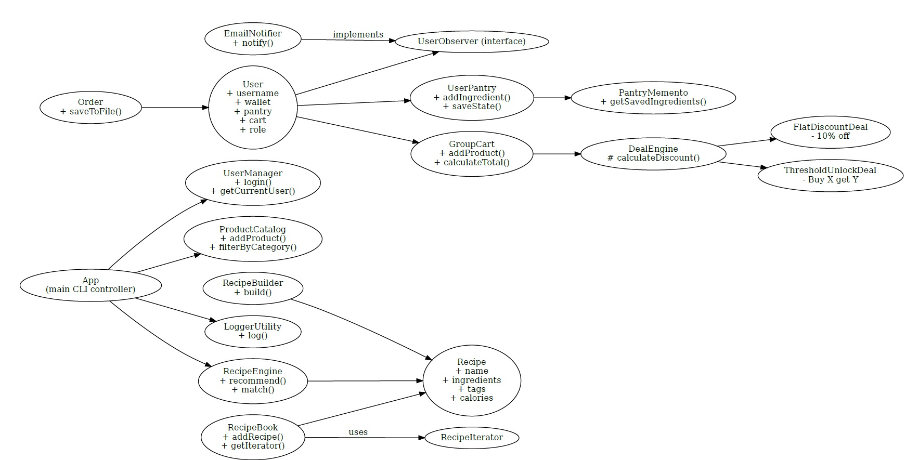

# PremiumSelect — Java Final Project

PremiumSelect is a CLI-based Java SE application designed to simulate a small-scale marketplace platform.  
It supports group pricing deals, personalized recipe recommendations, wallet management, and admin-level control over inventory and users.

---

## Features

- Multi-user login (admin / customer)
- Product catalog with tag/category filtering
- Smart recipe engine (by pantry, calorie, tags)
- GroupCart with strategy-based discounting
- Order tracking + wallet deduction
- Observer pattern to notify low wallet balance
- Clean object-oriented architecture (OOP)
- Save/load pantry, recipes, and receipts

---

## Design Patterns Used

| Pattern                 | Used For                                                |
| ----------------------- | ------------------------------------------------------- |
| **Factory**             | `IngredientFactory`                                     |
| **Composite**           | `CompositeIngredient`, `CompositeProduct`               |
| **Iterator**            | `RecipeIterator`, `CartIterator`                        |
| **Strategy**            | `DealEngine`, `FlatDiscountDeal`, `ThresholdUnlockDeal` |
| **Builder**             | `RecipeBuilder`                                         |
| **Memento**             | `PantryMemento` for pantry snapshots                    |
| **Observer**            | `UserObserver` + `EmailNotifier`                        |
| **Exception Shielding** | Input validation, graceful errors                       |
| **Logging**             | `LoggerUtility` → `premiumselect.log`                   |

---

## Project Structure

PremiumSelect/
├── src/ → Main Java classes
├── test/ → JUnit tests (RecipeEngineTest)
├── lib/ → JUnit 5 & dependencies
├── .vscode/ → VS Code classpath config
├── premiumselect.log → Log file
└── README.md

---

## How to Run Tests

javac -cp "lib/_;out" -d testbin test/_.java
java -cp "lib/\*;testbin;out" org.junit.platform.console.ConsoleLauncher --scan-classpath

## UML Diagram

##  Known Limitations

- No GUI (CLI only): The app runs in terminal mode; no graphical interface is available yet.
-  No authentication: Users log in by typing a name, but there’s no password or user verification.
- Recipes are stored in-memory: They are not yet persisted to file or database.
- Product catalog is hardcoded: Products are preloaded at runtime and not editable between sessions.
- No database: All state is lost between runs unless manually saved via I/O.
- No advanced search: Tag/category filtering is basic and non-fuzzy.
- No REST API: Not yet deployable as a service (e.g., no Spring Boot or HTTP interface).
- Only one test class: The current test suite includes `RecipeEngineTest` but not full coverage (e.g., `Cart`, `Wallet`, `Observer`).

## Future Work 
- Build a JavaFX or Swing-based GUI interface
- Integrate with a file or database to persist recipes and user carts
- Add authentication & password management
- Expand test suite (JUnit) to cover all modules
- Expose functionality via a REST API (Spring Boot)
- Connect to real-world food APIs (e.g., Spoonacular)
- Export orders as PDFs or CSV invoices
- Add inventory/stock control and reporting for admin
- integrate Stripe or PayPal for real wallet top-ups
